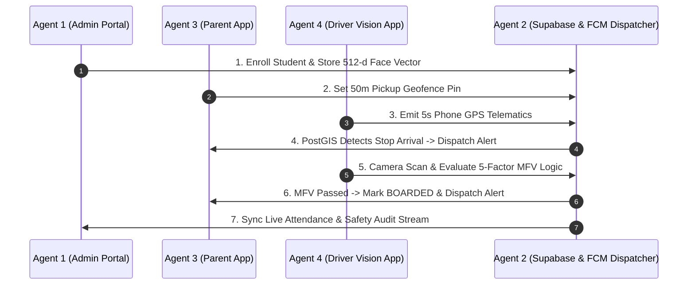

# 6:33audit — SafeRide AI Master Task Allocation & Workflow Specification

This document defines the 4-member workflow division and access keys for the **SafeRide AI** platform. Each team member / agent is responsible for their assigned domain to take the application from simulation to production readiness.

---

## 🔑 Access Matrix Summary

| Member / Role | Access Identifier | Focus Domain | Key Technologies |
| :--- | :--- | :--- | :--- |
| **Member 1 (Agent 1)** | `6:33auditagent1` | Cloud Database, Schema, Admin Portal & Student Onboarding | Supabase, PostgreSQL DDL, PostGIS, Next.js 14, pgvector |
| **Member 2 (Agent 2)** | `6:33auditagent2` | FCM Push Dispatcher, Supabase Realtime & Event Routing | Node.js, Firebase Cloud Messaging (FCM), WebSockets |
| **Member 3 (Agent 3)** | `6:33auditagent3` | Parent Mobile App, Pickup Geofencing & SOS Dispatch | Flutter, React PWA, Leaflet, flutter_map, FCM Client |
| **Member 4 (Agent 4)** | `6:33auditagent4` | Driver Mobile App, Hardware Telematics & Vision MFV Engine | Flutter, Geolocator, TFLite/MobileFaceNet, WebRTC Camera |

---

## 📋 4-Member Detailed Task Breakdown

### 👤 Member 1 (School Admin & Database Lead)
> **Access Key**: `6:33auditagent1`  
> **Primary Directory**: `/agent-1-admin-portal` & `/database`

#### Responsibilities:
1. **Database Schema Deployment & PostGIS Setup** (`database/schema.sql`, `database/postgis_triggers.sql`)
   - Provision Supabase cloud database instance.
   - Run DDL scripts for tables (`students`, `buses`, `routes`, `stops`, `transit_events`, `audit_logs`).
   - Enable `postgis` and `vector` extensions; verify `trg_bus_gps_geofence` trigger execution.
2. **Environment & Security Policies** (`database/rls_policies.sql`, `.env`)
   - Apply Row Level Security (RLS) policies for multi-tenant data access.
   - Set up API keys across sub-applications.
3. **Admin Dashboard & Fleet Management** (`agent-1-admin-portal/src/app/page.tsx`, `fleet/page.tsx`)
   - Connect Next.js 14 admin analytics cards and live fleet map to Supabase database.
4. **Biometric Student Onboarding Wizard** (`agent-1-admin-portal/src/app/students/page.tsx`)
   - Implement 3-step enrollment wizard with digital parental consent checkbox.
   - Extract 512-dimensional face embedding vectors and store into `students` table (`vector(512)`).

---

### 👤 Member 2 (Backend & Push Notification Lead)
> **Access Key**: `6:33auditagent2`  
> **Primary Directory**: `/services/notification-dispatcher` & `/src`

#### Responsibilities:
1. **Firebase Cloud Messaging (FCM) Integration** (`services/notification-dispatcher/src/fcm.js`)
   - Configure Firebase Admin SDK with `serviceAccountKey.json`.
   - Build FCM message formatting for **Alert #1** (*Bus Arrived at Pickup Pin*) and **Alert #2** (*Boarding Confirmed*).
2. **Supabase Realtime Event Dispatcher Listener** (`services/notification-dispatcher/src/index.js`)
   - Connect Node.js WebSocket client to `public:transit_events` database insert events.
   - Enforce event deduplication logic (prevent spamming alerts within 5-minute window).
3. **Central Web App Live State Synchronization** (`src/App.tsx`, `src/App.jsx`)
   - Wire `NotificationDispatcher.jsx` and main web app tabs to Supabase WebSocket channel (`admin_dashboard_feed`).

---

### 👤 Member 3 (Parent Mobile App Lead)
> **Access Key**: `6:33auditagent3`  
> **Primary Directory**: `/apps/parent-mobile`

#### Responsibilities:
1. **Interactive 50m Pickup Geofence Pin Manager** (`apps/parent-mobile/lib/screens/location_picker_screen.dart`, `src/components/MapLocationPicker.jsx`)
   - Enable tap-to-set and "Use My GPS" functionality for parents.
   - Save longitude/latitude to Supabase `stops` table to dynamically generate the 50m spherical geofence (`ST_SetSRID(ST_MakePoint(...), 4326)`).
2. **Real-Time Live Tracking Screen & Bus Route Marker** (`apps/parent-mobile/lib/screens/live_tracking_screen.dart`)
   - Render live bus marker updating continuously from `buses` telematics stream.
   - Render 50-meter visual geofence circle around student pickup pin.
3. **Transit Event Feed & Emergency SOS Handler** (`apps/parent-mobile/lib/screens/student_timeline_screen.dart`, `sos_modal.dart`)
   - Display real-time timeline badges (Route Started, Geofence Arrival, Boarded, Dropped Off).
   - Wire high-priority Emergency SOS button with custom alert reason selector.

---

### 👤 Member 4 (Driver Mobile & Computer Vision Lead)
> **Access Key**: `6:33auditagent4`  
> **Primary Directory**: `/apps/driver-mobile` & `/src/components/DriverPortal.tsx`

#### Responsibilities:
1. **Hardware Telematics GPS Streamer** (`apps/driver-mobile/lib/telematics/gps_streamer.dart`)
   - Integrate Flutter `geolocator` plugin to capture physical device phone GPS coordinates, speed, and heading every 5 seconds.
   - Push location updates to Supabase `buses` table (`current_latitude`, `current_longitude`).
2. **Driver Route Execution & Dynamic Stop Roster** (`apps/driver-mobile/lib/screens/route_execution_screen.dart`)
   - Implement route start/pause toggle and pull active stop list and student roster for current route.
3. **5-Factor Multi-Factor Verification (MFV) Engine** (`src/components/DriverPortal.tsx`, `DriverPortal.jsx`)
   - Integrate WebRTC / Mobile camera viewfinder.
   - Implement Face Embedding Cosine Similarity matcher ($\ge 0.82$ threshold).
   - Evaluate 5-factor gate checklist (Face Match + Bus ID Match + 50m Geofence Match + Stop Roster Match + Window Time Match).
   - Flag `MISMATCH_FLAGGED` on wrong bus boarding attempts.
4. **Driver Manual Override Handler**
   - Provide fallback driver PIN verification modal with mandatory reason logging for audit compliance.

---

## 🔄 Workflow Cycle & Verification

