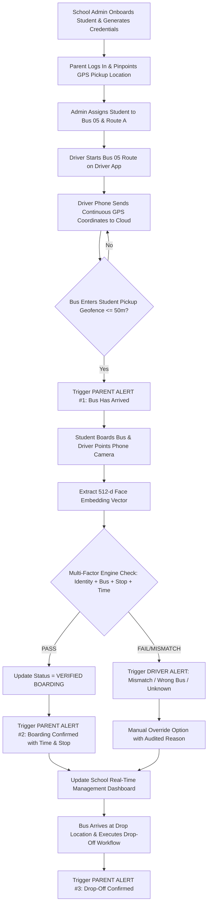
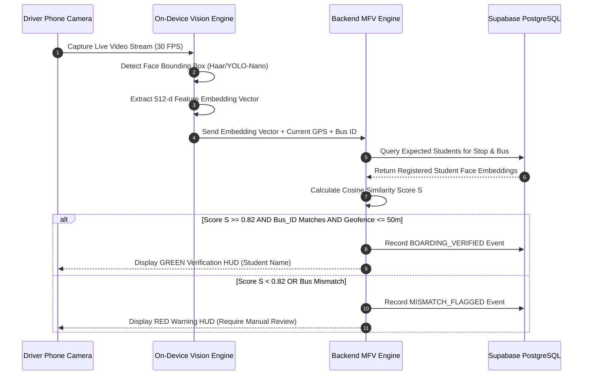

# SafeRide AI: Hardware-Free School Bus Student Safety System

> **Tagline:** Hardware-free, mobile-first, multi-factor student transportation safety and real-time parent verification platform.

---

## Table of Contents
1. [Project Title](#1-project-title)
2. [One-Line Tagline](#2-one-line-tagline)
3. [Problem Statement](#3-problem-statement)
4. [Abstract](#4-abstract)
5. [Existing Systems Analysis](#5-existing-systems-analysis)
6. [Problems with Existing Systems](#6-problems-with-existing-systems)
7. [Proposed System Overview](#7-proposed-system-overview)
8. [Key Innovations & Differentiators](#8-key-innovations--differentiators)
9. [Complete System Workflow](#9-complete-system-workflow)
10. [Detailed Feature List](#10-detailed-feature-list)
11. [Three-User Portal Architecture](#11-three-user-portal-architecture)
12. [Technical Architecture](#12-technical-architecture)
13. [Database Schema (PostgreSQL / Supabase DDL)](#13-database-schema-postgresql--supabase-ddl)
14. [API Specification](#14-api-specification)
15. [Face Verification Workflow](#15-face-verification-workflow)
16. [GPS & Geofencing Engine Workflow](#16-gps--geofencing-engine-workflow)
17. [Notification Dispatch Engine Workflow](#17-notification-dispatch-engine-workflow)
18. [Boarding Safety Verification Workflow](#18-boarding-safety-verification-workflow)
19. [Drop-Off Safety Verification Workflow](#19-drop-off-safety-verification-workflow)
20. [Exception & Error Handling Protocols](#20-exception--error-handling-protocols)
21. [Privacy, Security & Compliance Safeguards](#21-privacy-security--compliance-safeguards)
22. [Hackathon MVP Scope](#22-hackathon-mvp-scope)
23. [Future Enhancements & Scalability Roadmap](#23-future-enhancements--scalability-roadmap)
24. [Advantages & Benefits](#24-advantages--benefits)
25. [Limitations & Trade-offs](#25-limitations--trade-offs)
26. [Use-Case Diagram Description](#26-use-case-diagram-description)
27. [Data-Flow Diagram (DFD) Description](#27-data-flow-diagram-dfd-description)
28. [Sequence Diagram Description](#28-sequence-diagram-description)
29. [Recommended Technology Stack](#29-recommended-technology-stack)
30. [24-Hour Hackathon Development Plan](#30-24-hour-hackathon-development-plan)
31. [Team Member Task Distribution](#31-team-member-task-distribution)
32. [Hackathon Presentation PPT Structure](#32-hackathon-presentation-ppt-structure)
33. [2-Minute Judging Pitch](#33-2-minute-judging-pitch)
34. [Live Demo Script & Scenario for Judges](#34-live-demo-script--scenario-for-judges)
35. [Judge Q&A Preparation & Defensible Responses](#35-judge-qa-preparation--defensible-responses)
36. [GitHub Deployment & 5-Agent Architecture Setup](#36-github-deployment--5-agent-architecture-setup)

---

## 1. Project Title
**SafeRide AI: Hardware-Free School Bus Student Safety System**

## 2. One-Line Tagline
*"Hardware-free, mobile-first student transit safety powered by geofenced multi-factor verification."*

---

## 3. Problem Statement
Educational institutions currently rely on error-prone manual attendance registers, driver/conductor headcounts, or capital-intensive dedicated hardware (RFID cards, dedicated GPS vehicle trackers, biometric hardware units, and wearable bands) to track student transit safety. 

These legacy methods suffer from critical vulnerabilities:
1. **High Hardware Overhead:** Installing dedicated GPS trackers or RFID readers on every bus and issuing smart cards to thousands of students creates high upfront deployment and recurring maintenance costs.
2. **Loss & Proxy Boarding:** RFID cards are frequently lost, forgotten, damaged, or swapped by students, leading to false proxy boarding records.
3. **Information Asymmetry for Parents:** Parents lack real-time visibility into when a bus actually reaches their pickup point versus when their child actually steps onto the bus.
4. **Lack of Contextual Safety Rules:** Existing tracking apps only show bus GPS locations without verifying whether a specific child boarded the correct bus at the correct stop during the expected time window.

---

## 4. Abstract
**SafeRide AI** is a lightweight, mobile-first smart notification and identity assistance platform designed to eliminate hardware dependencies in student transportation safety. By connecting School Management, Bus Staff, and Parents through role-tailored mobile interfaces, SafeRide AI creates a cryptographically secured and geo-verifiable digital trail connecting: 
`Student ➔ Biometric Template ➔ Parent ➔ GPS Pickup Point ➔ Assigned Bus & Route ➔ Verified Transit Event`.

Rather than treating computer vision as an infallible single point of truth, SafeRide AI enforces a **Multi-Factor Verification (MFV)** engine. A boarding event is validated ONLY when five vectors converge:
1. Face Embeddings Match (Cosine similarity $> 0.82$)
2. Driver Phone GPS within the Registered Stop Geofence ($\le 50\text{ m}$)
3. Bus ID matched to Student’s Assigned Bus Schedule
4. Expected Student List matching current stop index
5. Timestamp within active route parameters

The system automatically generates two distinct push notifications for parents:
- **Alert #1 (Geofence Arrival):** "Bus 05 has arrived at your child's pickup location."
- **Alert #2 (Boarding Confirmation):** "Boarding Confirmed: Alex has safely boarded Bus 05 at 7:42 AM."

SafeRide AI delivers institutional-grade student safety at zero dedicated hardware cost, using only smartphones already owned by drivers and parents.

---

## 5. Existing Systems Analysis
Currently deployed student transit safety solutions fall into three main categories:
1. **Manual Logbooks & Phone Calls:** Conductor manually checks off names on a paper list and calls parents during emergencies.
2. **Standard GPS Bus Tracking Apps:** Telematics box installed under the bus dashboard streams location coordinates to a parent map view.
3. **RFID / Smart Card Tap Systems:** Card reader mounted near the bus door; student taps card upon entry, sending an SMS notification.

---

## 6. Problems with Existing Systems

| Feature / Metric | Manual Logbooks | Standard Bus Trackers | RFID / Smart Card Systems | SafeRide AI (Proposed) |
| :--- | :--- | :--- | :--- | :--- |
| **Dedicated Hardware Cost** | $\$0$ | $\$200 - \$500$ per bus | $\$1,500+$ per bus + $\$5$/student card | **\$0 (Hardware-Free)** |
| **Card Loss / Damage Risk** | N/A | N/A | High (Daily card loss) | **Zero (Biometric & App-based)** |
| **Proxy Boarding Risk** | High (Human error) | N/A (Does not verify student) | High (Friends tap card for each other) | **Zero (Multi-Factor Verification)** |
| **Parent Arrival Alert** | None | Manual distance estimates | None (Only alerts on card tap) | **Automated Geofence Alert (#1)** |
| **Verified Boarding Alert** | Delayed / None | None | Tap-triggered (Unverified identity) | **Automated Contextual Alert (#2)** |
| **Wrong Bus Detection** | Manual inspection | None | Flagged only after central sync | **Real-time instant flag on Driver App** |
| **Deployment Time** | Instant | Weeks (Wiring & installation) | Months (Hardware fitting & provisioning) | **Immediate (App Store download)** |

---

## 7. Proposed System Overview
SafeRide AI converts commodity smartphones into intelligent safety hubs. The system comprises three interconnected mobile applications linked to a cloud backend:

1. **School Management Portal (Web/Mobile):** Master control center for student onboarding, bus route mapping, parent-student linking, real-time fleet analytics, safety exception management, and privacy logs.
2. **Parent Mobile Application:** Onboarding tool for registering precise GPS pickup/drop coordinates via interactive maps, live tracking view, historical timeline, emergency hotline, and two-stage automated push notifications.
3. **Driver / Bus Staff App:** Route navigator, geofence detector, high-speed camera verification interface (offline-capable face feature extractor), student roster status indicator (Boarded, Pending, Mismatched), and emergency reporter.

---

## 8. Key Innovations & Differentiators

```
+-----------------------------------------------------------------------------------+
|                            MULTI-FACTOR VERIFICATION                              |
+-----------------------------------------------------------------------------------+
|  [Face Template Match]  +  [Assigned Bus ID]  +  [GPS Geofence <=50m]            |
|  + [Expected Stop Index] +  [Active Route Window] = VERIFIED TRANSIT EVENT         |
+-----------------------------------------------------------------------------------+
```

1. **Hardware-Free Zero CAPEX Architecture:** Operates entirely on commodity smartphones. Eliminates dedicated hardware procurement, installation, and upkeep.
2. **Two-Stage Contextual Alerts:**
   - *Alert #1 (Bus Arrived):* Triggered silently by background GPS geofence matching ($\le 50\text{ meters}$).
   - *Alert #2 (Boarding Confirmed):* Triggered only after successful multi-factor verification.
3. **Multi-Factor Verification (MFV) Rule Engine:** Prevents spoofing, proxy boarding, and misrouting by combining facial embedding vectors with physical spatial-temporal checks.
4. **Privacy-Preserving On-Device Embeddings:** Raw photos are processed into 512-dimensional floating-point feature vectors on-device using MobileFaceNet/FaceNet, then discarded immediately. Raw facial images are never stored on cloud servers.
5. **Human-in-the-Loop Fallback Protocol:** If face recognition fails due to lighting or occlusion, the driver can execute a fallback passcode/manual verification, which logs an audited "Driver Verified Manually" event visible to school management.

---

## 9. Complete System Workflow



---

## 10. Detailed Feature List

### 10.1 School Management Application
- **Student Identity & Consent Management:** Upload student bio-data, parental consent documentation, and enrollment photo.
- **Route & Bus Fleet Configurator:** Define buses, assign drivers, plot route waypoints, and set geofence radiuses (10m–100m).
- **Live Fleet Monitor:** Real-time map displaying all active buses, speed telemetry, and route adherence.
- **Exception & Safety Incident Center:** Immediate alerts for mismatched boarding, unverified expected students, route deviations, or manual overrides.
- **Historical Audit & Attendance Export:** Download CSV/PDF logs for institutional transportation compliance.

### 10.2 Parent Mobile Application
- **GPS Pickup Point Selector:** Drag-and-drop map pin to register precise home pickup/drop coordinates.
- **Two-Stage Notification Feed:** In-app notification center + push notifications for Geofence Arrival & Verified Boarding/Drop-Off.
- **Live Bus Location Tracker:** View real-time location of assigned bus once route is active.
- **Child Attendance Timeline:** Daily timeline showing `Geofence Arrival (7:38 AM)` ➔ `Boarded (7:40 AM)` ➔ `School Arrival (8:10 AM)`.
- **Emergency Helpline & SOS:** One-tap call button to connect with driver, bus conductor, or school transportation desk.

### 10.3 Driver / Bus Staff Mobile Application
- **Route Execution Interface:** Start/Pause/End route execution with automated GPS tracking.
- **Dynamic Student Roster:** List of students grouped by stop, with live status indicators (Expected, Boarded, Absent, Mismatched).
- **Camera Scanning Engine:** Fast live-camera scanning view with instant visual feedback (Green box = Verified, Red box = Mismatch).
- **Manual Override Mode:** Quick manual check-in with reason selection (e.g., "Lighting condition," "Face covered," "Driver recognized") subject to audit.
- **One-Tap Emergency Alert:** Send SOS signal to school admin in case of breakdowns, traffic delays, or medical issues.

---

## 11. Three-User Architecture

```
                                  +---------------------------------------+
                                  |    SCHOOL MANAGEMENT ADMIN PORTAL     |
                                  |     (Web App / Next.js Dashboard)     |
                                  +-------------------+-------------------+
                                                      |
                                                      v
                                  +-------------------+-------------------+
                                  |      SUPABASE / POSTGRES BACKEND      |
                                  |   Row Level Security | Realtime Engine|
                                  +---------+-------------------+---------+
                                            |                   |
                    +-----------------------+                   +-----------------------+
                    |                                                                   |
                    v                                                                   v
+-------------------+-------------------+                           +-------------------+-------------------+
|       DRIVER MOBILE APPLICATION       |                           |       PARENT MOBILE APPLICATION       |
|    (Flutter / Camera / GPS Stream)    |                           |     (Flutter / Maps / FCM Push)       |
+---------------------------------------+                           +---------------------------------------+
```

---

## 12. Technical Architecture

```
[Mobile Apps (Flutter)] <---> [REST / WebSockets API] <---> [Node.js / Supabase Backend]
                                                                     |
       +-------------------------------------------------------------+-------------------------------------------------------------+
       |                                                             |                                                             |
       v                                                             v                                                             v
[PostgreSQL Database]                                    [PostGIS Geofencing Engine]                                   [Firebase Cloud Messaging (FCM)]
 - Row Level Security                                     - ST_DWithin Sphere Calc                                     - Low-Latency Push Notifications
 - 512-d Vector Embeddings                                - Dynamic Radius Check                                       - Background Service Receiver
```

---

## 13. Database Schema (PostgreSQL / Supabase DDL)

```sql
-- Enable PostGIS and Vector Extensions
CREATE EXTENSION IF NOT EXISTS postgis;
CREATE EXTENSION IF NOT EXISTS vector;

-- 1. USERS & ROLES TABLE
CREATE TYPE user_role AS ENUM ('ADMIN', 'DRIVER', 'PARENT');

CREATE TABLE users (
    id UUID PRIMARY KEY DEFAULT gen_random_uuid(),
    full_name VARCHAR(100) NOT NULL,
    email VARCHAR(150) UNIQUE NOT NULL,
    phone_number VARCHAR(20) NOT NULL,
    role user_role NOT NULL,
    created_at TIMESTAMP WITH TIME ZONE DEFAULT CURRENT_TIMESTAMP
);

-- 2. BUSES TABLE
CREATE TABLE buses (
    id UUID PRIMARY KEY DEFAULT gen_random_uuid(),
    bus_number VARCHAR(20) UNIQUE NOT NULL,
    license_plate VARCHAR(30) NOT NULL,
    capacity INT NOT NULL,
    driver_id UUID REFERENCES users(id),
    is_active BOOLEAN DEFAULT TRUE
);

-- 3. ROUTES & STOPS TABLE
CREATE TABLE route_stops (
    id UUID PRIMARY KEY DEFAULT gen_random_uuid(),
    route_name VARCHAR(100) NOT NULL,
    stop_name VARCHAR(100) NOT NULL,
    stop_location GEOMETRY(Point, 4326) NOT NULL,
    geofence_radius_meters FLOAT DEFAULT 50.0,
    stop_sequence INT NOT NULL
);

-- 4. STUDENTS TABLE
CREATE TABLE students (
    id UUID PRIMARY KEY DEFAULT gen_random_uuid(),
    student_id_code VARCHAR(50) UNIQUE NOT NULL,
    first_name VARCHAR(50) NOT NULL,
    last_name VARCHAR(50) NOT NULL,
    class_grade VARCHAR(20) NOT NULL,
    parent_id UUID REFERENCES users(id) ON DELETE CASCADE,
    assigned_bus_id UUID REFERENCES buses(id),
    assigned_stop_id UUID REFERENCES route_stops(id),
    face_embedding vector(512), -- 512-d MobileFaceNet template vector
    parent_consent_given BOOLEAN DEFAULT FALSE,
    created_at TIMESTAMP WITH TIME ZONE DEFAULT CURRENT_TIMESTAMP
);

-- 5. TRANSIT EVENTS TABLE
CREATE TYPE event_type AS ENUM ('GEOFENCE_ARRIVAL', 'BOARDING_VERIFIED', 'BOARDING_MANUAL_OVERRIDE', 'DROP_OFF_VERIFIED', 'MISMATCH_FLAGGED');

CREATE TABLE transit_events (
    id UUID PRIMARY KEY DEFAULT gen_random_uuid(),
    student_id UUID REFERENCES students(id),
    bus_id UUID REFERENCES buses(id),
    driver_id UUID REFERENCES users(id),
    stop_id UUID REFERENCES route_stops(id),
    event_type event_type NOT NULL,
    verification_confidence FLOAT, -- Cosine similarity score
    gps_coordinates GEOMETRY(Point, 4326) NOT NULL,
    override_reason VARCHAR(255),
    created_at TIMESTAMP WITH TIME ZONE DEFAULT CURRENT_TIMESTAMP
);

-- Create Spatial Index on Route Stops
CREATE INDEX idx_route_stops_location ON route_stops USING GIST(stop_location);
```

---

## 14. API Specification

### 14.1 Driver App Endpoints
- `POST /api/v1/driver/route/start`
  - **Payload:** `{ "bus_id": "UUID", "route_id": "UUID" }`
  - **Response:** `{ "status": "ACTIVE", "assigned_stops": [...] }`
- `POST /api/v1/driver/location/update`
  - **Payload:** `{ "bus_id": "UUID", "latitude": 12.9716, "longitude": 77.5946, "timestamp": "ISO-8601" }`
  - **Response:** `{ "geofence_events": [{ "stop_id": "UUID", "triggered_alert": "GEOFENCE_ARRIVAL" }] }`
- `POST /api/v1/driver/verify-boarding`
  - **Payload:** `{ "bus_id": "UUID", "detected_embedding": [0.12, -0.45, ...], "current_latitude": 12.9716, "current_longitude": 77.5946 }`
  - **Response:** `{ "verification_status": "VERIFIED", "student": { "id": "UUID", "name": "Alex Smith" }, "confidence": 0.89 }`

### 14.2 Parent App Endpoints
- `PUT /api/v1/parent/pickup-location`
  - **Payload:** `{ "student_id": "UUID", "latitude": 12.9720, "longitude": 77.5950 }`
  - **Response:** `{ "status": "SUCCESS", "geofence_registered": true }`
- `GET /api/v1/parent/student-status/:student_id`
  - **Response:** `{ "current_status": "BOARDED", "last_event": "BOARDING_VERIFIED", "timestamp": "07:42 AM", "bus_number": "Bus 05" }`

---

## 15. Face Verification Workflow



---

## 16. GPS & Geofencing Engine Workflow
1. Driver’s mobile app streams background GPS telemetry every **5 seconds** via high-accuracy Location API.
2. Cloud backend evaluates current GPS point against assigned stop coordinates using PostGIS spherical distance math:
   $$\text{Distance} = \text{ST\_DistanceSphere}(\text{bus\_location}, \text{stop\_location})$$
3. When $\text{Distance} \le 50\text{ meters}$ and stop state is `PENDING`, system fires `GEOFENCE_ARRIVAL`.
4. Parent notification pipeline receives `GEOFENCE_ARRIVAL` event payload and dispatches Alert #1 via FCM instantly.

---

## 17. Notification Dispatch Engine Workflow

```
[Transit Event Generated] 
       │
       ▼
[Event Dispatcher Filter] ─── (Checks User Preferences & Deduplication Lock)
       │
       ▼
[Construct Notification Payload]
       ├── Title: "Bus Arrived at Pickup Location" / "Boarding Confirmed"
       ├── Body: "Alex has safely boarded Bus 05 at 7:42 AM."
       └── Data Payload: { student_id, bus_id, event_type, timestamp }
       │
       ▼
[Firebase Cloud Messaging (FCM) API]
       │
       ▼
[Parent Device OS APNS / FCM Receiver] ─── (Rings Sound & Shows Banner)
```

---

## 18. Boarding Safety Verification Workflow
1. Driver arrives at geofenced stop.
2. Parent receives **Alert #1 (Bus Arrived)**.
3. Student approaches bus door; driver holds mobile app camera at chest/face height.
4. Camera extracts 512-d vector in $\le 300\text{ ms}$.
5. Multi-Factor Engine evaluates 5 parameters simultaneously.
6. Upon 5-factor pass:
   - Screen turns green with haptic chime.
   - Student marked `BOARDED` on driver roster.
   - Parent receives **Alert #2 (Boarding Confirmed)**.
   - School dashboard updates active onboard count.

---

## 19. Drop-Off Safety Verification Workflow
1. Bus reaches afternoon registered drop-off geofence.
2. Parent receives **Alert: "Bus Arriving at Drop-Off Point"**.
3. Student steps off bus; driver scans face or confirms drop-off on driver UI.
4. System verifies student is at their designated drop-off stop.
5. System logs `DROP_OFF_VERIFIED` event with GPS stamp and timestamp.
6. Parent receives **Alert #3: "Alex has been dropped off at 4:15 PM"**.

---

## 20. Exception & Error Handling Protocols

| Exception Scenario | Detection Mechanism | Immediate Action | Fallback & Audit Trail |
| :--- | :--- | :--- | :--- |
| **Wrong Bus Boarding** | Face matches Student A, but Student A is assigned to Bus 02 (Current: Bus 08). | Driver app flashes RED warning banner: *"Wrong Bus Alert: Student assigned to Bus 02"*. | Boarding BLOCKED. Driver instructs student or executes manual override with reason *"Emergency Bus Swap"*. Admin alerted instantly. |
| **Face Recognition Fail** | Low light, heavy glasses, or camera lens blur ($S < 0.82$). | Driver UI displays *"Face Not Recognized - Retry or Manual Check-In"*. | Driver selects student from stop roster, enters 4-digit PIN, and logs reason *"Lighting/Hat"*. Event saved as `BOARDING_MANUAL_OVERRIDE`. |
| **Unverified Missing Student** | Geofence arrival logged, but expected student face not scanned within 3 mins. | Driver roster marks student status as `UNVERIFIED_PENDING`. | App prompts driver: *"Did Student A miss the bus?"*. Driver marks `ABSENT`. Admin dashboard flagged. |
| **Loss of Cellular Data** | Driver phone enters dead zone / offline network state. | App switches to **Local SQLite Offline Cache** for face templates & route logic. | Queue events locally. Auto-sync to cloud & send queued FCM alerts as soon as signal restores. |

---

## 21. Privacy, Security & Compliance Safeguards
- **Zero Raw Image Storage:** Facial photos taken during registration are converted into 512-dimensional numerical vectors on device. Raw photo files are immediately purged from temporary storage.
- **Biometric Hash Non-Reversibility:** 512-d vectors cannot be mathematically reconstructed into the original human face image.
- **Explicit Parental Consent:** Required digital consent checkbox signed by parent prior to biometric vector creation.
- **Row-Level Security (RLS):** Supabase database policies enforce strict data isolation: Parents can ONLY query records belonging to their linked `student_id`.
- **Encryption Standards:** TLS 1.3 in transit; AES-256 for database storage at rest.

---

## 22. Hackathon MVP Scope
For the 24-hour hackathon build, prioritize a rock-solid end-to-end execution of this core scenario:

```
[1 Student + 1 Parent + 1 Driver] 
  ➜ [Parent Registers GPS Pin on Map] 
  ➜ [Driver Starts Simulated Bus 01 Route] 
  ➜ [Simulate GPS entering Geofence] 
  ➜ [Parent receives Alert #1: Bus Arrived] 
  ➜ [Driver scans student face using web camera / phone] 
  ➜ [System verifies identity + bus match] 
  ➜ [Parent receives Alert #2: Boarding Confirmed] 
  ➜ [School Admin Dashboard updates live status]
```

---

## 23. Future Enhancements & Scalability Roadmap
- **ETA Predictive AI:** Machine learning route ETA predictions based on historical traffic patterns.
- **Automated Attendance Integration:** Direct REST webhook sync with school ERP systems (e.g., Canvas, PowerSchool, Google Classroom).
- **BLE Beacon Backup:** Low-cost Bluetooth beacon on bus door as a secondary automatic check-in channel.
- **Voice Alert Accessibility:** Audio notification playback for parents with visual impairments.

---

## 24. Advantages & Benefits
- **Zero Cost Barrier:** Schools implement transit tracking with zero hardware expenditure.
- **Anti-Spoofing Safety:** Multi-factor contextual engine prevents proxy boarding and false identity claims.
- **Peace of Mind for Parents:** Timely arrival alerts eliminate long waits at bus stops in bad weather.
- **Institutional Compliance:** Automated audit trail shields schools from liability and lost-student incidents.

---

## 25. Limitations & Trade-Offs
- **Phone Battery & GPS Dependency:** Driver app requires continuous GPS background tracking, requiring a smartphone dashboard mount with power charging.
- **Camera Speed in Crowd:** Scanning 40 students individually at the door takes $\sim 15-20$ seconds total ($\sim 0.5\text{s}$ per student); bus staff must hold camera steadily.
- **Environmental Factors:** Extreme direct sunlight or pitch-dark bus interiors require smartphone flash activation or manual override.

---

## 26. Use-Case Diagram Description
- **Actors:** School Admin, Driver / Bus Staff, Parent, System Timer / Background Worker.
- **Use Cases:**
  - *School Admin:* Onboard Student, Assign Bus & Route, View Fleet Dashboard, Audit Safety Exceptions.
  - *Parent:* Set GPS Pickup Coordinates, Track Live Bus, Receive Arrival Alert (#1), Receive Boarding Alert (#2), Call Driver.
  - *Driver:* Start/End Route, Stream GPS Location, Scan Student Face, Execute Manual Override, Send SOS Signal.
  - *System Engine:* Compute Geofence Intersection, Compute Vector Cosine Distance, Dispatch FCM Push Notifications.

---

## 27. Data-Flow Diagram (DFD) Description
- **Level 0 DFD (Context Diagram):**
  - External Entities: Admin, Parent, Driver, Firebase FCM Service.
  - Core System: SafeRide AI Platform.
  - Data Inputs: Student enrollment data, GPS stream, facial camera stream, pickup pin coordinates.
  - Data Outputs: Arrival alerts, boarding confirmations, exception flags, administrative analytics.
- **Level 1 DFD:**
  - Process 1.0: Identity & Geofence Provisioning.
  - Process 2.0: Telematics & PostGIS Geofence Matching.
  - Process 3.0: On-Device Vision & Multi-Factor Verification.
  - Process 4.0: Event Logging & Push Notification Dispatcher.

---

## 28. Sequence Diagram Description
- **Actors/Objects:** Driver App ➔ Background GPS Streamer ➔ Supabase PostGIS ➔ Notification Dispatcher ➔ Parent App ➔ Camera Vision Module ➔ Verification Engine.
- **Steps:**
  1. Driver App posts continuous GPS stream to PostGIS backend.
  2. PostGIS runs `ST_DWithin` sphere check against `route_stops`.
  3. When distance $\le 50\text{m}$, PostGIS emits `GEOFENCE_ARRIVED` trigger.
  4. Dispatcher sends Alert #1 to Parent FCM token. Parent UI receives push alert.
  5. Driver points camera at student face; Vision Module extracts 512-d vector.
  6. Verification Engine validates vector match + bus match + stop match.
  7. Verification Engine records `BOARDING_VERIFIED` in database.
  8. Dispatcher dispatches Alert #2 to Parent FCM token.

---

## 29. Recommended Technology Stack

| Layer | Technology Selected | Justification |
| :--- | :--- | :--- |
| **Mobile Frontend** | Flutter (Dart) | Single codebase for Android & iOS; high performance for native camera & GPS. |
| **Admin Web Frontend** | React / Next.js (TypeScript) + TailwindCSS | Fast responsive dashboard with real-time WebSocket data updates. |
| **Backend & Database** | Supabase (PostgreSQL + PostGIS + pgvector) | Built-in geospatial query engine, vector database, and instant Realtime subscriptions. |
| **Face Recognition Engine** | MobileFaceNet / face_api.js (On-Device) | Extremely lightweight ML model running locally on mobile device in $\le 200\text{ms}$. |
| **Push Notifications** | Firebase Cloud Messaging (FCM) | Reliable cross-platform low-latency background notification delivery. |
| **Maps & Geocoding** | Mapbox GL / Google Maps SDK | Interactive pin placement and smooth vector map tile rendering. |

---

## 30. 24-Hour Hackathon Development Plan

```
[Hour 00 - 04] Architecture Setup, Database DDL Deployment, Flutter & Next.js Scaffolding
[Hour 04 - 08] Student/Parent Onboarding UI + PostGIS Geofence Setup + GPS Streaming Logic
[Hour 08 - 14] Camera Face Embeddings Integration + Multi-Factor Rules Engine Implementation
[Hour 14 - 18] Firebase FCM Notification Dispatcher + Driver Roster & Parent Dashboard Sync
[Hour 18 - 21] Simulated GPS Movement Script + Exception & Manual Override UI Polish
[Hour 21 - 24] End-to-End Live Scenario Testing + Demo Script Preparation & Slide Deck Finalization
```

---

## 31. Team Member Task Distribution

| Team Member | Role | Key Responsibilities |
| :--- | :--- | :--- |
| **Member 1 (Lead / Architect)** | Full-Stack & Supabase Dev | Database DDL, PostGIS geofencing triggers, Multi-Factor validation backend logic. |
| **Member 2 (Mobile Specialist)** | Flutter Driver App & GPS | Driver UI, high-accuracy GPS streaming module, camera scanner integration. |
| **Member 3 (AI & Mobile Vision)** | Machine Learning Engineer | MobileFaceNet embedding extraction pipeline, cosine distance calculator, camera HUD. |
| **Member 4 (Frontend & UX)** | Next.js & Parent App Dev | Parent map interface, School Admin analytics dashboard, FCM push setup. |

---

## 32. Hackathon Presentation PPT Structure
- **Slide 1:** Title Slide (*SafeRide AI: Hardware-Free School Bus Safety*)
- **Slide 2:** The Problem (*Manual headcounts & expensive \$500/bus hardware trackers*)
- **Slide 3:** The Core Innovation (*Multi-Factor Mobile Safety: Identity + Bus + GPS + Geofence*)
- **Slide 4:** Three-User Ecosystem (*School Admin ➔ Driver ➔ Parent*)
- **Slide 5:** Two-Stage Notification Concept (*Alert #1 Arrival vs Alert #2 Verified Boarding*)
- **Slide 6:** Technical Architecture & Privacy Safeguards (*PostGIS + pgvector 512-d embeddings*)
- **Slide 7:** Live Demo Scenario (*Simulated Route Execution & Real-Time Alerts*)
- **Slide 8:** Market Viability & Scalability (*Zero CAPEX deployment model for schools*)

---

## 33. 2-Minute Judging Pitch
> *"Judges, every single day, millions of parents experience anxiety wondering if their child safely stepped onto the right school bus. Current solutions force schools to buy thousands of dollars in expensive hardware trackers and RFID cards that kids lose on day one.*
> 
> *Introducing **SafeRide AI** — the world's first hardware-free, mobile-first student transportation safety platform.*
> 
> *SafeRide AI turns smartphones into intelligent safety nodes. When the bus enters a 50-meter geofence of a child's home, our background GPS engine instantly sends **Alert #1: Bus Has Arrived**. When the student boards, the driver's phone camera scans their face in under 300 milliseconds. But we don't just rely on face recognition alone — our Multi-Factor Verification engine cross-references the face embedding with the child's assigned bus, expected stop, and GPS position. Only when all factors pass does the system log a verified event and send **Alert #2: Boarding Confirmed**.*
> 
> *Zero hardware costs. Zero proxy boarding. Complete peace of mind. SafeRide AI makes student transit safety accessible to every school, everywhere."*

---

## 34. Live Demo Script & Scenario for Judges
1. **Step 1 (Setup):** Show School Admin Dashboard on laptop with Student "Alex Smith" assigned to Bus 01.
2. **Step 2 (Parent View):** Open Parent App on Mobile Device A; show registered pickup pin.
3. **Step 3 (Driver Route Start):** Open Driver App on Mobile Device B; tap *"Start Bus 01 Morning Route"*.
4. **Step 4 (Geofence Trigger):** Toggle *"Simulate Bus Arrival at Stop 1"*. Within 1 second, Mobile Device A receives Push Notification: **"Bus 01 has arrived at Alex's pickup location."**
5. **Step 5 (Face Verification):** Point Mobile Device B's camera at Alex's test face. The screen flashes GREEN: *"Verified: Alex Smith"*.
6. **Step 6 (Boarding Confirmation):** Mobile Device A receives Push Notification: **"Boarding Confirmed: Alex has safely boarded Bus 01 at 7:42 AM."**
7. **Step 7 (Admin Dashboard Update):** Show laptop screen updating live count: *Onboard: 1 / Pending: 0*.

---

## 35. Judge Q&A Preparation & Defensible Responses

### Q1: "What if a student wears a mask, hat, or lighting is dark inside the bus?"
**Response:** "Face recognition in SafeRide AI is an identity verification assistance tool, not an absolute blocker. If confidence drops below 0.82 due to extreme lighting or occlusion, the driver app provides a 2-second manual fallback override where the driver selects the student and enters a PIN. This logs an audited `BOARDING_MANUAL_OVERRIDE` event visible to the school admin."

### Q2: "How do you protect children's facial privacy?"
**Response:** "We strictly enforce privacy by design. Raw images are processed entirely on-device and converted into mathematical 512-dimensional numerical feature vectors. Raw photos are destroyed immediately. The numerical vector stored in our database cannot be reverse-engineered into a visual face image, ensuring full compliance with biometric privacy regulations."

### Q3: "What happens if a student boards the wrong bus by mistake?"
**Response:** "Our Multi-Factor Engine instantly flags this scenario. Even if the facial recognition matches Student A, the system detects that Student A is assigned to Bus 02 while the scan occurred on Bus 08. The driver app immediately flashes a bright RED alert stating *'Wrong Bus Assignment'*, preventing misrouting before the bus leaves."

---

## 36. GitHub Deployment & 5-Agent Architecture Setup

To orchestrate this project seamlessly across a multi-agent development workflow, the project structure and agent divisions are documented in [`AGENT_ORCHESTRATION.md`](file:///c:/Users/Ratna+Prasad/Desktop/Safebusride_ai/AGENT_ORCHESTRATION.md).

### GitHub Target Repository:
`https://github.com/jwjohnwesly5-png/safe-ride`

---
*Created for the SafeRide AI Hackathon Project.*
